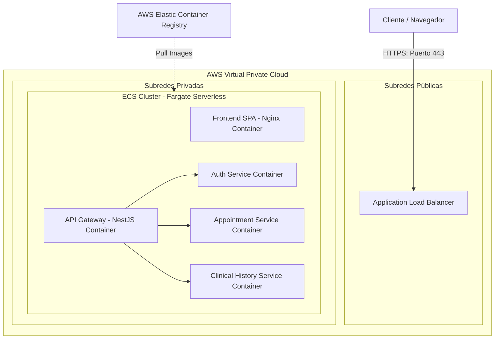

# Guía de Despliegue en AWS: ECS & Fargate

Este manual detalla los pasos para empaquetar, subir y desplegar nuestra Plataforma de Telemedicina en contenedores serverless utilizando **AWS ECS (Elastic Container Service)** sobre **AWS Fargate** (sin servidor).

---

## 1. Arquitectura de Despliegue en AWS



---

## 2. Definición de Tareas en ECS (ECS Task Definition)

Una **Definición de Tarea (Task Definition)** es el plano que AWS utiliza para saber qué imágenes de contenedor correr, qué puertos exponer, cuánta CPU/Memoria asignar y qué variables de entorno inyectar.

Aquí está la especificación en formato JSON para desplegar el **API Gateway** y el resto de los microservicios en un único grupo o por separado.

### `task-definition.json` (Ejemplo de API Gateway)
```json
{
  "family": "telemed-api-gateway",
  "networkMode": "awsvpc",
  "requiresCompatibilities": [
    "FARGATE"
  ],
  "cpu": "256",
  "memory": "512",
  "executionRoleArn": "arn:aws:iam::123456789012:role/ecsTaskExecutionRole",
  "taskRoleArn": "arn:aws:iam::123456789012:role/ecsTaskRole",
  "containerDefinitions": [
    {
      "name": "api-gateway",
      "image": "123456789012.dkr.ecr.us-east-1.amazonaws.com/telemed-api-gateway:latest",
      "essential": true,
      "portMappings": [
        {
          "containerPort": 8000,
          "hostPort": 8000,
          "protocol": "tcp"
        }
      ],
      "environment": [
        { "name": "NODE_ENV", "value": "production" },
        { "name": "GATEWAY_PORT", "value": "8000" },
        { "name": "AUTH_SERVICE_PORT", "value": "8001" },
        { "name": "APPOINTMENT_SERVICE_PORT", "value": "8002" },
        { "name": "CLINICAL_HISTORY_SERVICE_PORT", "value": "8003" },
        { "name": "JWT_SECRET", "value": "tu-jwt-llave-secreta-de-produccion" },
        { "name": "ENCRYPTION_KEY", "value": "tu-clave-aes-de-32-caracteres-prod" }
      ],
      "logConfiguration": {
        "logDriver": "awslogs",
        "options": {
          "awslogs-group": "/ecs/telemed-api-gateway",
          "awslogs-region": "us-east-1",
          "awslogs-stream-prefix": "ecs"
        }
      }
    }
  ]
}
```

---

## 3. Guía de Despliegue Paso a Paso

### Paso 1: Crear repositorios en ECR (Elastic Container Registry)
Debes crear un repositorio para cada componente de tu sistema:
```bash
aws ecr create-repository --repository-name telemed-frontend --region us-east-1
aws ecr create-repository --repository-name telemed-api-gateway --region us-east-1
aws ecr create-repository --repository-name telemed-auth-service --region us-east-1
aws ecr create-repository --repository-name telemed-appointment-service --region us-east-1
aws ecr create-repository --repository-name telemed-clinical-history-service --region us-east-1
```

### Paso 2: Autenticar Docker local con AWS ECR
```bash
aws ecr get-login-password --region us-east-1 | docker login --username AWS --password-stdin 123456789012.dkr.ecr.us-east-1.amazonaws.com
```
*(Reemplaza `123456789012` con tu ID de Cuenta AWS real).*

### Paso 3: Construir, etiquetar y subir las imágenes Docker

#### A. Subir el Frontend SPA
```bash
docker build -t telemed-frontend ./frontend
docker tag telemed-frontend:latest 123456789012.dkr.ecr.us-east-1.amazonaws.com/telemed-frontend:latest
docker push 123456789012.dkr.ecr.us-east-1.amazonaws.com/telemed-frontend:latest
```

#### B. Subir el API Gateway
```bash
docker build -t telemed-api-gateway -f ./services/apps/services/Dockerfile ./services
docker tag telemed-api-gateway:latest 123456789012.dkr.ecr.us-east-1.amazonaws.com/telemed-api-gateway:latest
docker push 123456789012.dkr.ecr.us-east-1.amazonaws.com/telemed-api-gateway:latest
```

#### C. Subir el Auth Service
```bash
docker build -t telemed-auth-service -f ./services/apps/auth-service/Dockerfile ./services
docker tag telemed-auth-service:latest 123456789012.dkr.ecr.us-east-1.amazonaws.com/telemed-auth-service:latest
docker push 123456789012.dkr.ecr.us-east-1.amazonaws.com/telemed-auth-service:latest
```

*(Y repetir el proceso para los servicios de Citas e Historial Clínico).*

---

### Paso 4: Crear la Red (VPC) y el Clúster ECS
1. Crea una **VPC** con subredes públicas y privadas (con NAT Gateway en las subredes públicas para que los contenedores en las privadas salgan a Internet para las llamadas a APIs como Stripe).
2. Crea un clúster de ECS compatible con Fargate:
   ```bash
   aws ecs create-cluster --cluster-name TelemedicinaCluster --region us-east-1
   ```

### Paso 5: Registrar las Definiciones de Tareas en AWS
Registra las plantillas JSON que creaste en el paso 2:
```bash
aws ecs register-task-definition --cli-input-json file://task-definition.json --region us-east-1
```

### Paso 6: Configurar el Balanceador de Carga (Application Load Balancer)
1. Crea un **ALB** orientado a Internet en tus subredes públicas.
2. Crea **Target Groups** (Grupos de Destino) con tipo de destino `IP` para:
   - El Frontend: Puerto 80
   - El API Gateway: Puerto 8000
3. Configura reglas de enrutamiento en el ALB:
   - El tráfico que va a `/*` se envía al target group del Frontend.
   - El tráfico que va a `/api/*` o `/auth/*`, `/appointments/*`, `/clinical-history/*` y `/video/*` se redirige al target group del API Gateway.

### Paso 7: Desplegar los Servicios de ECS (Fargate Services)
Crea servicios que mantengan tus contenedores en ejecución e integrados con el balanceador de carga:
```bash
aws ecs create-service \
  --cluster TelemedicinaCluster \
  --service-name frontend-service \
  --task-definition telemed-frontend:1 \
  --desired-count 2 \
  --launch-type FARGATE \
  --network-configuration "awsvpcConfiguration={subnets=[subnet-12345,subnet-67890],securityGroups=[sg-abcde],assignPublicIp=ENABLED}" \
  --load-balancers "targetGroupArn=arn:aws:elasticloadbalancing:...,containerName=frontend,containerPort=80" \
  --region us-east-1
```

*(Hacer lo mismo para el api-gateway apuntando al puerto 8000 y el resto de los microservicios, asegurándote de que los microservicios backend solo expongan sus puertos en subredes privadas para máxima seguridad).*
